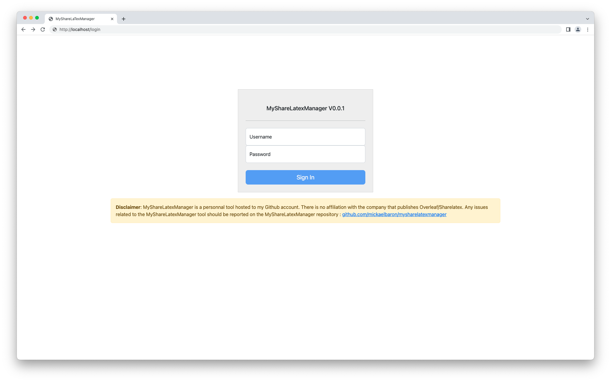
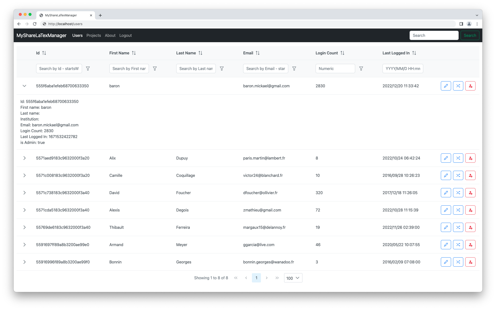
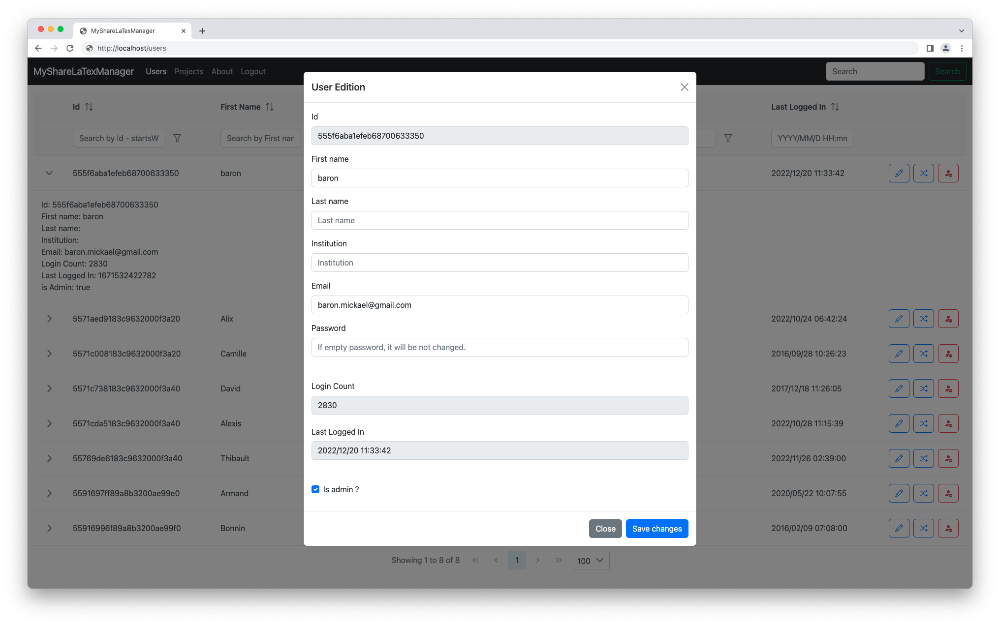
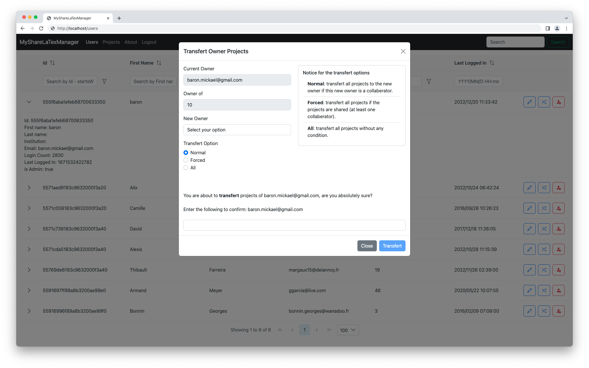
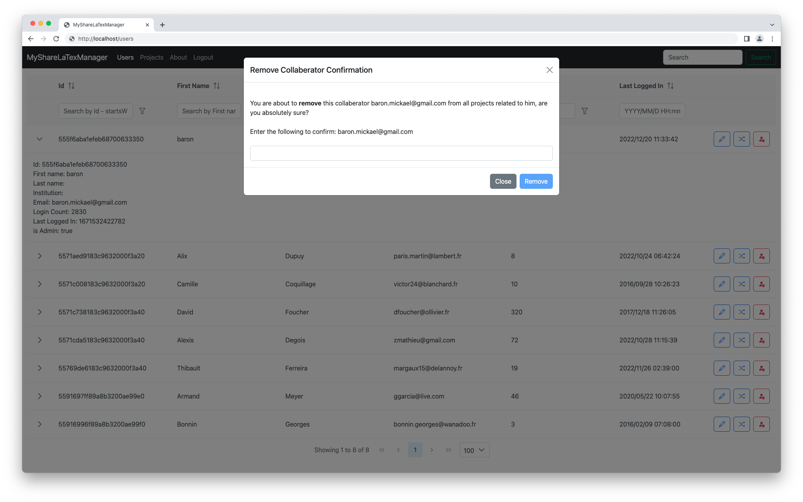
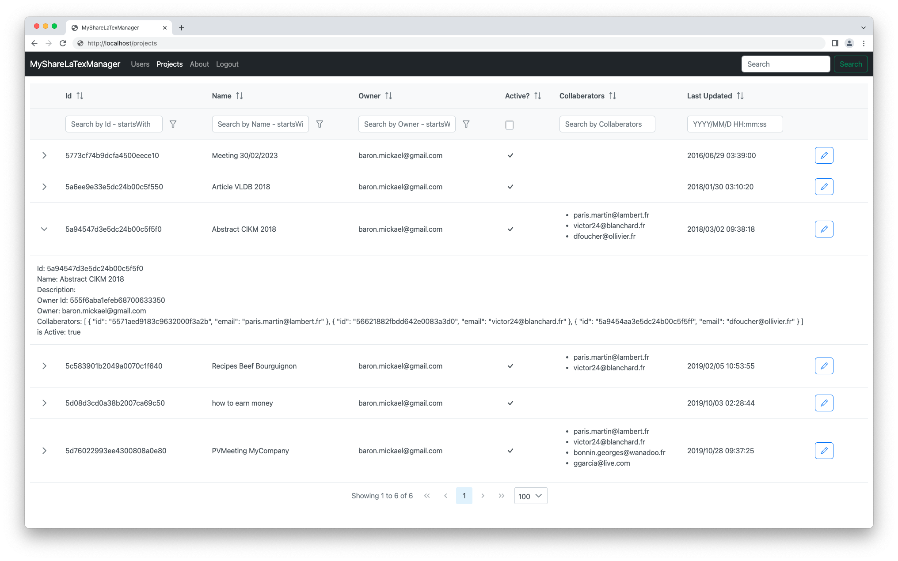
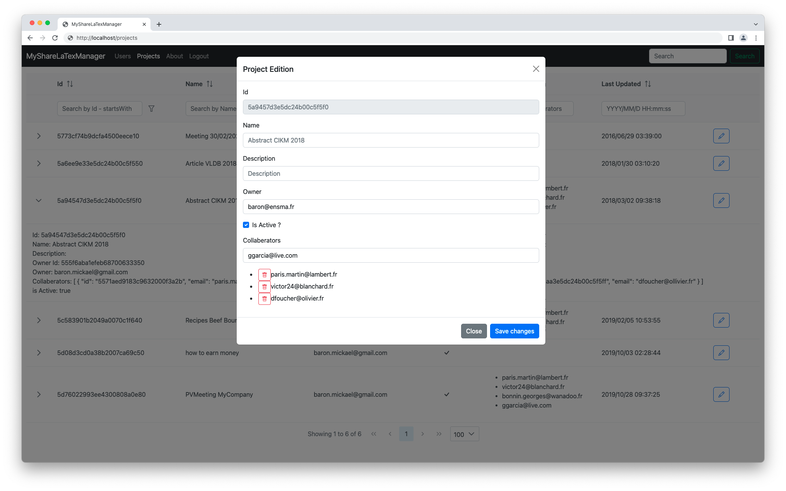

# MySharelatexManager

MySharelatexManager is an UI tool to manage users and projects for Overleaf/ShareLaTex self hosted instances (Community edition). Only data (`users` and `projects` collections) from Mongo database are required.

> **Disclaimer**: MyShareLatexManager is a personnal tool hosted to my Github account. There is no affiliation with the company that publishes Overleaf/Sharelatex, it's completely unofficial. Any issues related to the MyShareLatexManager tool should be reported on the MyShareLatexManager repository : [github.com/mickaelbaron/mysharelatexmanager](https://github.com/mickaelbaron/mysharelatexmanager).

Main functionnal features supported by MyShareLatexManager:

* List all users,
* Edit user,
* Transfert owner projects to other one,
* Remove user as collaberator to all projects,
* List all projects,
* Edit project.

Technicals concepts with MyShareLatexManager:

* front-end in [Vue.js](https://vuejs.org/), [Vite.js](https://vitejs.dev/), ([PrimeVue](https://primevue.org/) and [Boostrap](https://getbootstrap.com/)),
* back-end in Java 11 with the [MicroProfile](https://microprofile.io/) specifications and [KumuluzEE](https://ee.kumuluz.com/) implementation (JAX-RS and CDI),
* using the given/when/then style for Java unit test,
* full build with [Docker](https://www.docker.com/),
* deployement with [Docker](https://www.docker.com/).

## Software requirements

* [Docker](https://www.docker.com/) (that's all)

MySharelatexManager building and deployement have been tested on:

* macOS Ventura (with DockerDesktop),
* Linux Ubuntu 20.04.01

In fact, all operating systems that support [Docker](https://www.docker.com/) can build and test MySharelatexManager.

## Screenshots

* Login



* Display all users



* Edit the user parameters



* Transfert the owner projects



* Remove collaberator confirmation



* Display all projects



* Edit the project parameters



## Build MysharelatexManager

### Configure before

In the case you do not need a subpath, go to the next section.

* If you want to use a subpath to deploy MySharelatexManager (i.e. <http://localhost/YOUR_SUBPATH>), edit the *mysharelatexmanager/mysharelatexmanager-rp/subpath.conf* file and replace all the `YOUR_SUBPATH` strings by your preferred value (i.e. `mysharelatexmanager`).

```yaml
server {
    listen 80;

    location /YOUR_SUBPATH/server/ {
        proxy_pass http://backend:9991/;
        proxy_http_version 1.1;
        proxy_set_header Connection "";
    }

    location /YOUR_SUBPATH/ {
        rewrite ^/YOUR_SUBPATH(/.*)$ $1 break;
        proxy_pass http://frontend;
        proxy_http_version 1.1;
        proxy_set_header Upgrade $http_upgrade;
        proxy_set_header Connection 'upgrade';
        proxy_set_header Host $host;
        proxy_cache_bypass $http_upgrade;
    }
}
```

* Edit the *mysharelatexmanager/mysharelatexmanager-vuejs/.env.subpath* file and replace all the `YOUR_SUBPATH` strings by your chosen value (i.e. `mysharelatexmanager`).

```properties
VITE_APP_SERVER_URL = /YOUR_SUBPATH/server
VITE_APP_SUBPATH = /YOUR_SUBPATH/
NODE_ENV = production
```

### Build

* To build without subpath: <https://localhost>, execute this command line:

```console
$ docker compose build --build-arg script_name=build
```

* To build with subpath: <http://localhost/YOUR_SUBPATH>, execute this command line:

```console
$ docker compose build  --build-arg script_name=subpath
```

* To check if the images are been built, execute this command line:

```console
$ docker images
REPOSITORY                     TAG                 IMAGE ID            CREATED             SIZE
mysharelatexmanager/rp         latest              48030aad5995        3 seconds ago       20.4MB
mysharelatexmanager/server     latest              d8456b59f4f3        28 minutes ago      185MB
mysharelatexmanager/vuejs      latest              8c5b713e6b83        3 hours ago         22.8MB
...
```

## Run MysharelatexManager

### Configure before

We suppose Sharelatex/Overleaf is deployed by [Docker](https://www.docker.com/) and a Docker network is existing (Docker network is used for communicating between containers).

* Edit the *mysharelatexmanager/docker-compose.yml* file and match the name of Sharelatex network you use (`name: sharelatexnetwork`).

```yaml
...
networks:
  mysharelatexmanagernetwork:
  sharelatexnetwork:
    external:
      name: sharelatexnetwork
```

* We suppose that `Sharelatex` network is already existing, create a Docker network for MySharelatexManager called `mysharelatexmanagernetwork`

```console
$ docker network create mysharelatexmanagernetwork
```

### Run

* From the root of the project, execute this command line:

```console
$ docker compose up -d
```

* Open the <http://localhost> (without subpath) or <http://localhost/YOUR_SUBPATH> (with a subpath) URL with your favorite web browser.

## Bonus (to have a local Overleaf/Sharelatex database)

In this section, we present how to test MySharelatexManager with a dataset (without install a full instance of Overleaf/Sharelatex). Only, MongoDB will be installed by Docker. We suppose you have an existing instance of Overleaf/Sharelatex in production.

* From the server where Overleaf/Sharelatex is running, extract the dataset.

```console
$ docker run --rm --network sharelatexnetwork -v $(pwd)/mongodump:/backup mongo:4.4.19 bash -c 'mongodump -d sharelatex --gzip --archive=/backup/sharelatex-dump.gz --host sharelatex-mongodb:27017'
```

> Please, adapt the version of MongoDB Docker image.

The result of this extraction will be available into the *mongodump* directory. Copy the *mongodump* directory to your computer.

From your computer (where you want to test MysharelatexManager), create an empty instance of MongoDB database.

```console
$ docker network create sharelatexnetwork # Optional if this Docker network is existing
$ docker run --name sharelatex-mongodb -p 27017:27017 --network sharelatexnetwork -d mongo:4.4.19
```

From the *mongodump* directory location, import the content

```console
$ docker run --rm --network sharelatexnetwork -v $(pwd):/backup mongo:4.4.19 bash -c 'mongorestore /backup --gzip --archive=/backup/sharelatex-dump.gz --noIndexRestore --host sharelatex-mongodb:27017'
```
