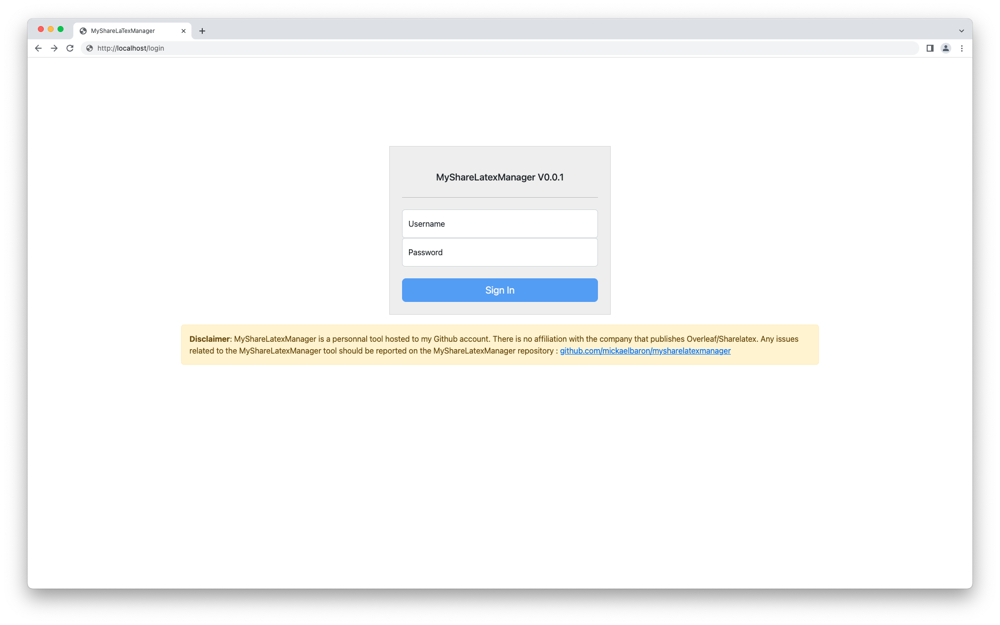
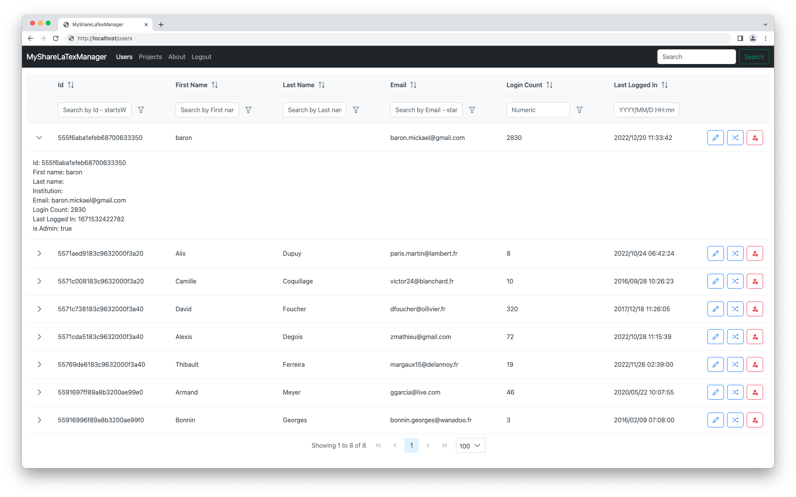
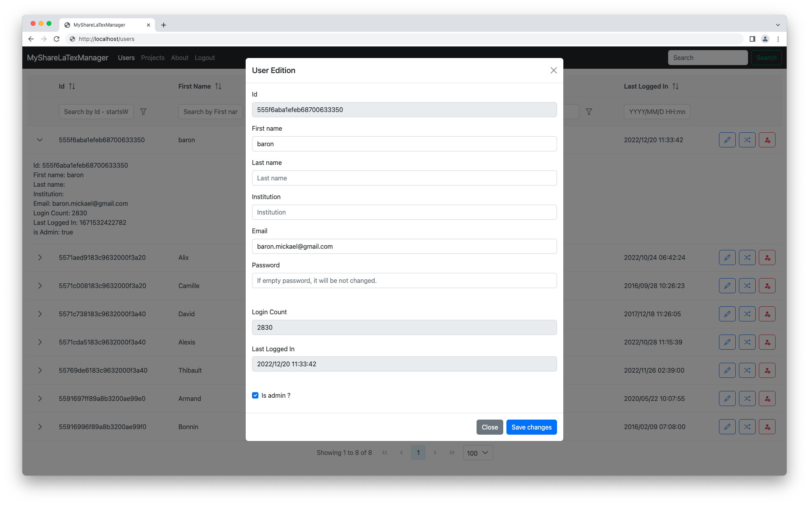
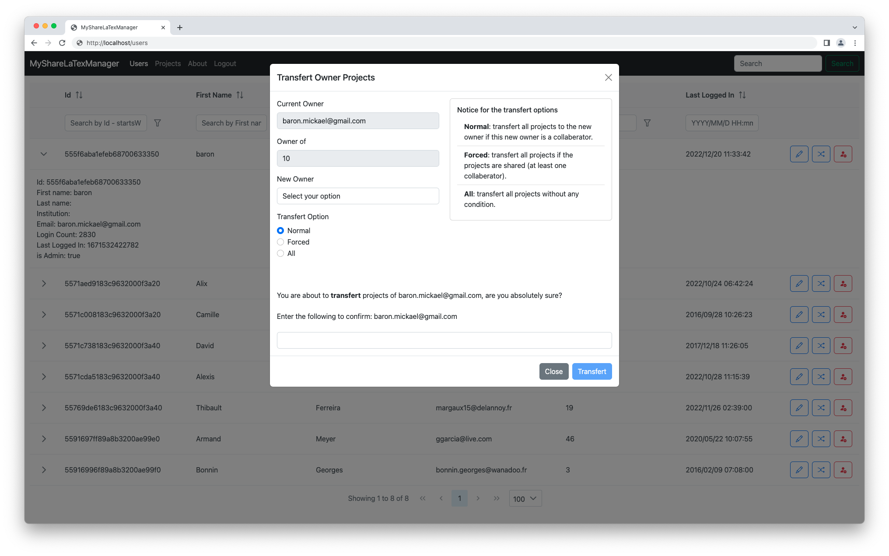
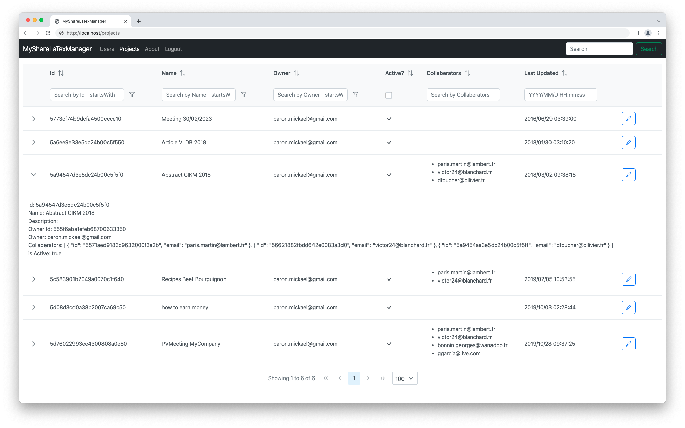
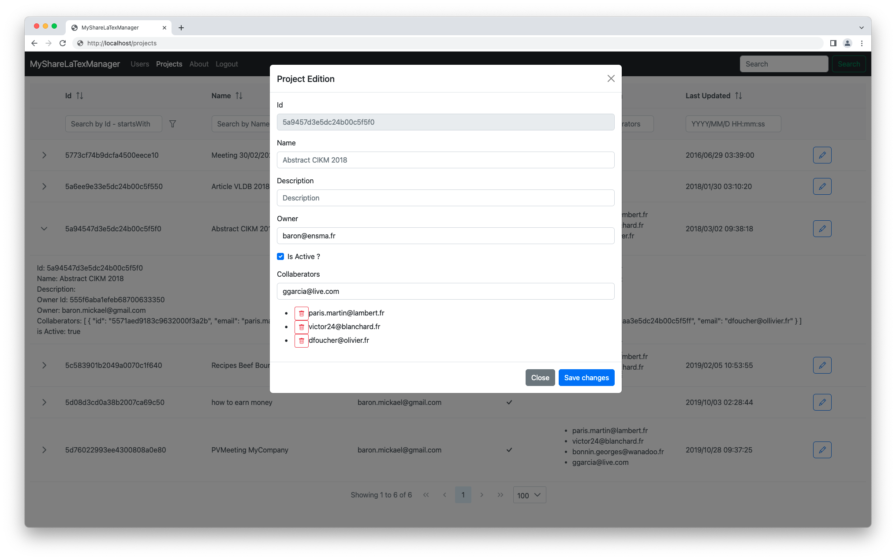

# MySharelatexManager

MySharelatexManager is an UI tool to manage users and projects for Overleaf/ShareLaTex self hosted instances (Community edition). Only data (`users` and `projects` collections) from Mongo database are required.

> **Disclaimer**: MyShareLatexManager is a personnal tool hosted to my Github account. There is no affiliation with the company that publishes Overleaf/Sharelatex, it's completely unofficial. Any issues related to the MyShareLatexManager tool should be reported on the MyShareLatexManager repository : [github.com/mickaelbaron/mysharelatexmanager](https://github.com/mickaelbaron/mysharelatexmanager).

Main functionnal features supported by MyShareLatexManager:

* List all users,
* Edit user,
* Transfert owner projects to other one,
* Remove user as collaborator to all projects,
* List all projects,
* Edit project.

Functionnalités pas encore supportées:

* Remove user,
* Delete project.

Technicals concepts with MyShareLatexManager:

* front-end in [Vue.js](https://vuejs.org/), [Vite.js](https://vitejs.dev/), ([PrimeVue](https://primevue.org/) and [Boostrap](https://getbootstrap.com/)),
* back-end in Java 11 with the [MicroProfile](https://microprofile.io/) specifications and [OpenLiberty](https://openliberty.io/) implementation (JAX-RS and CDI),
* using the Given/When/Then style for Java unit tests with [JUnit 5](https://junit.org/), [Mockito](https://site.mockito.org/) and [TestContainers](https://testcontainers.com/),
* full build with [Docker](https://www.docker.com/) (integration tests [TestContainers](https://testcontainers.com/) with are not passing yet),
* deployement with [Docker](https://www.docker.com/).

## Software requirements

* [Docker](https://www.docker.com/) (that's all)

MySharelatexManager building and deployement have been tested on:

* macOS Tahoe (with DockerDesktop),
* Linux Ubuntu 20.04.01

In fact, all operating systems that support [Docker](https://www.docker.com/) can build and test MySharelatexManager.

## Screenshots

* Login



* Display all users



* Edit the user parameters



* Transfert the owner projects



* Remove collaborator confirmation


* Display all projects



* Edit the project parameters



## Build MysharelatexManager

* To build without subpath: <https://localhost>, execute this command line:

```bash
docker compose build 
```

* To build with subpath: <http://localhost/YOUR_SUBPATH>, execute this command line:

```bash
docker compose build  --build-arg SUBPATH=mysharelatexmanager
```

* To check if the images are been built, execute this command line:

```bash
docker images
REPOSITORY                     TAG                 IMAGE ID            CREATED             SIZE
mysharelatexmanager/rp         latest              48030aad5995        3 seconds ago       20.4MB
mysharelatexmanager/server     latest              d8456b59f4f3        28 minutes ago      185MB
mysharelatexmanager/vuejs      latest              8c5b713e6b83        3 hours ago         22.8MB
...
```

## Run MysharelatexManager

### Configure Docker network

We suppose Sharelatex/Overleaf is deployed by [Docker](https://www.docker.com/) and a Docker network is existing (Docker network is used for communicating between containers).

* Edit the *mysharelatexmanager/compose.yaml* file and match the name of Sharelatex network you use (`name: sharelatexnetwork`).

```yaml
...
networks:
  mysharelatexmanagernetwork:
    name: mysharelatexmanagernetwork
  sharelatexnetwork:
    name: sharelatexnetwork
    external: true
```

### Configure back-end

The back-end includes a set of configuration parameters that can be customized using environment variables. 

* `mysharelatexmanager.mongodb.url`: MongoDB database URL (default value: `mongodb://localhost:27017`)
* `mysharelatexmanager.identification.user`: name of the single user (default value: `admin`)
* `mysharelatexmanager.identification.password`: password of the single user (default value: `adminadmin`)
* `mysharelatexmanager.encrypt.password`: encryption key (default value: `!thisismypassword!`)
* `mysharelatexmanager.encrypt.noise`: encryption salt/noise (default value: `@BCDEFGHIJKLMNPQRSTUVWXZ&bcdefghijklmnopqrstuvwxyz0123456789`)
* `mysharelatexmanager.session.timeout`: session renewal timeout
* `mysharelatexmanager.userfiles.path`: path to the ShareLaTeX `user_files` directory

To modify these values, add the corresponding environment variables to the *compose.yaml* file.

```yaml
  ...
  msm-backend:
    build: mysharelatexmanager-backend/
    image: mysharelatexmanager/server
    external_links:
      - sharelatex-mongo
    environment: 
      mysharelatexmanager.mongodb.url: mongodb://sharelatex-mongodb:27017
  ...
```

### Run

* From the root of the project, execute this command line:

```bash
docker compose up -d
```

* Open the <http://localhost> (without subpath) or <http://localhost/YOUR_SUBPATH> (with a subpath) URL with your favorite web browser.

## Bonus (to have a local Overleaf/Sharelatex database)

In this section, we present how to test MySharelatexManager with a dataset (without install a full instance of Overleaf/Sharelatex). Only, MongoDB will be installed by Docker. We suppose you have an existing instance of Overleaf/Sharelatex in production.

* From the server where Overleaf/Sharelatex is running, extract the dataset.

```bash
docker run --rm --network sharelatexnetwork -v $(pwd)/mongodump:/backup mongo:4.4.19 bash -c 'mongodump -d sharelatex --gzip --archive=/backup/sharelatex-dump.gz --host sharelatex-mongodb:27017'
```

> Please, adapt the version of MongoDB Docker image.

The result of this extraction will be available into the *mongodump* directory. Copy the *mongodump* directory to your computer.

From your computer (where you want to test MysharelatexManager), create an empty instance of MongoDB database.

```bash
docker network create sharelatexnetwork # Optional if this Docker network is existing
docker run --name sharelatex-mongodb -p 27017:27017 --network sharelatexnetwork -d mongo:4.4.19
```

From the *mongodump* directory location, import the content

```bash
docker run --rm --network sharelatexnetwork -v $(pwd):/backup mongo:4.4.19 bash -c 'mongorestore /backup --gzip --archive=/backup/sharelatex-dump.gz --noIndexRestore --host sharelatex-mongodb:27017'
```